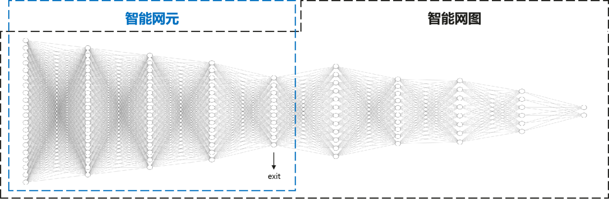

||
|:--:|

# NEGCLIT Overview

[English](./README.md) | [简体中文](./README.zh-CN.md)

## Background


||
|:--:|
|figure 1: relationship between intelligent network element and graph|
## Getting Started

NEGCLIT can be deployed on a single host or on multiple nodes. Choose the deployment approach which matches your environment.
### Quick Start（Standalone deployment）

<details open>
<summary>Install</summary>

Clone repo and install [requirements.txt](./requirements.txt) in a
[**Python>=3.7.0**](https://www.python.org/) environment, including
[**PyTorch>=1.7**](https://pytorch.org/get-started/locally/).

```bash
git clone https://github.com/xiangyulee/NEGCLIT  # clone
cd NEGCLIT
pip install -r requirements.txt  # install
```

</details>

<details open>
<summary>run method 1</summary>
Note: Be sure to modify the "username" and "password" in the launch script before running it.

```bash
bash launch_ex1.sh
```

</details>

<details open>
<summary>run method 2</summary>

```bash
bash launch_ex2.sh
```

</details>


### Cluster deployment

To be updated.
## Documentation
### NEGCLIT Design 

- [Workflow](./doc/workflow/README.md)

### Developer Resources

- [Developer Guide for NEGCLIT](./doc/develop//README.md)
- [EGCLIT API references](./doc/api/README.md)
## test results
## Acknowledgments

- [Fedlab](https://github.com/SMILELab-FL/FedLab)
- [Prune](https://github.com/Eric-mingjie/network-slimming)
- [OCL](https://github.com/RaptorMai/online-continual-learning)

## License

[Apache License 2.0](LICENSE)