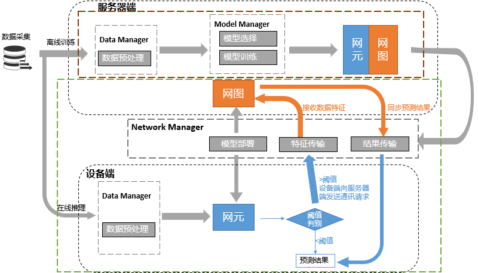
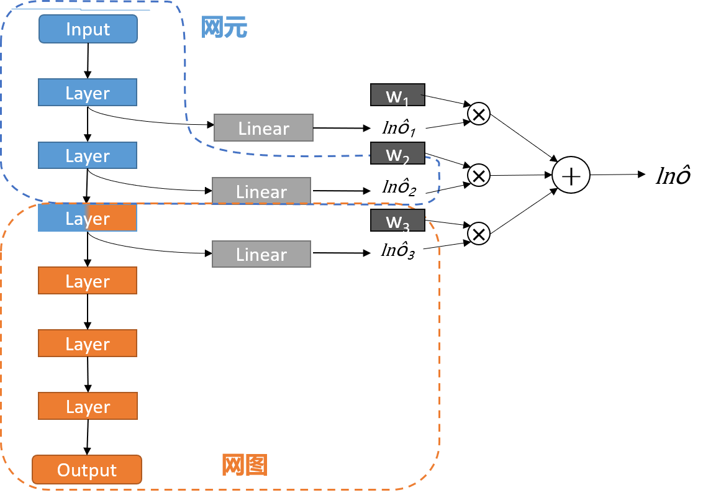
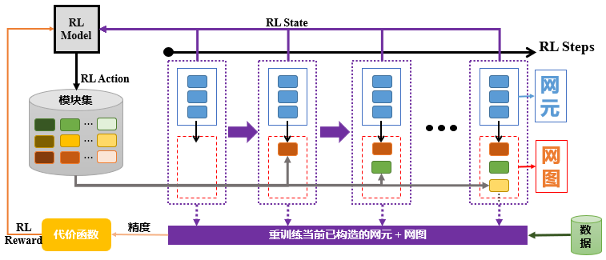

# Workflow

[English](./README.md) | [简体中文](./README.zh-CN.md)

## Overview

||
|:--:|
|Figure 1: NEGCLIT Overview|

The overall operation of the NEGLECT can be divided into two major parts: offline and online.
During the offline training phase, it mainly includes the data management and model management modules. The data management module is responsible for data preprocessing, while the model management module is responsible for model selection and training, ultimately obtaining the network element and network graph models.
Once the network element and network graph models are obtained, we deploy the network element model on the device side and the network graph model on the server side for subsequent online inference and online training stages through the network management module.

During the online inference phase, the process starts with the device side. After preprocessing the collected raw data, it is fed into the network element model. If the result is below the threshold, the prediction result is directly output. If it is above the threshold, the network management module needs to send a communication request to the server side, uploading the unrecognizable data features to the server side for accurate recognition by the network graph model. The prediction results obtained by the network graph model are still synchronized to the device side through the network management module.

## Offline Training Method 1

||
|:--:|
|Figure 2: Offline Training Method 1|

- Adaptive determination of model segmentation points: Use multiple classifier heads for training at the network frontend, set a loss function to determine the importance of each classifier head, and reward the best single classifier head to determine the optimal segmentation point of the model.
- After model segmentation, set an adaptive threshold to ensure the accuracy of the network element-side model and decide whether to upload features to the network graph-side for further segmentation.

## Offline Training Method 2

||
|:--:|
|Figure 3: Offline Training Method 2|

- Dynamic generation of neural networks: Deploy small models suitable for edge devices directly on the network element-side, and generate subsequent network graph-side models through dynamic generation of neural networks.
- Neural network architecture search: Use reinforcement learning to search for the best network structure of modules, with module accuracy as the reward mechanism, and compare to select the optimal module.
- Network generation strategy: Maintain a small top heap of a preset size, add the test accuracy of each epoch during training to the heap, and if the heap reaches the set size and the heap's top accuracy is greater than the current accuracy, clear the heap and generate a new module.

