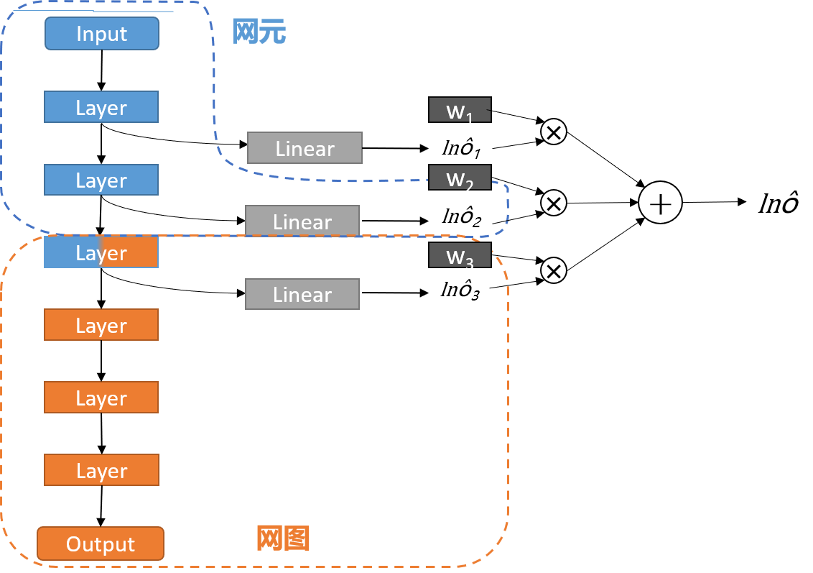

# 工作流

[English](./README.md) | [简体中文](./README.zh-CN.md)

## 概述

||
|:--:|
|图 1：NEGCLIT 概述|

元图协同整体工作分为离线和在线两大部分。
在离线训练阶段，主要包括数据管理和模型管理模块，数据管理模块主要负责数据的预处理，模型管理模块则负责模型的选择与训练，最终得到网元网图模型。
得到网元网图模型后我们在通过网络管理模块将网元模型部署在设备端，网图模型部署在服务器端进行后续的在线推理和在线训练等阶段。
在在线推理阶段，首先是设备端，采集的原始数据在进行数据预处理后，传入网元模型，经阈值判断，如果小于阈值则直接输出预测结果，如果大于阈值则需要通过网络管理模块向服务器端发送通讯请求，将无法识别的数据特征上传至服务器端，由网图模型进行精准识别。网图得到的预测结果仍然是通过网络管理模块同步至设备端。

## 离线训练方法 1

||
|:--:|
|图 2：离线训练方法 1|

- 自适应确定模型分割点：在网络前端使用多个分类器头进行训练，设定损失函数确定每个分类器头的重要性，并奖励最佳的单个分类器头，确定模型的最佳分割点。
- 模型分割后，通过设定自适应阈值确保网元端模型的准确性，判别是否将特征上传至网图端进行细分。

## 离线训练方法 2

||
|:--:|
|图 3：离线训练方法 2|

- 动态生成神经网络：直接在网元端部署适用于边缘设备的小模型， 通过动态生成神经网络生成后续网图端模型。
- 神经网络架构搜索：采用强化学习搜索模块最佳网络结构，以模块准确率作为奖励机制，对比后选择最优模块。
- 网络生成策略：维护一个预先设定好大小的小顶堆，把训练时每个epoch的测试精度加入堆，如果堆达到设定大小，且堆顶的精度大于当前精度，则清空堆，并生成新模块。
